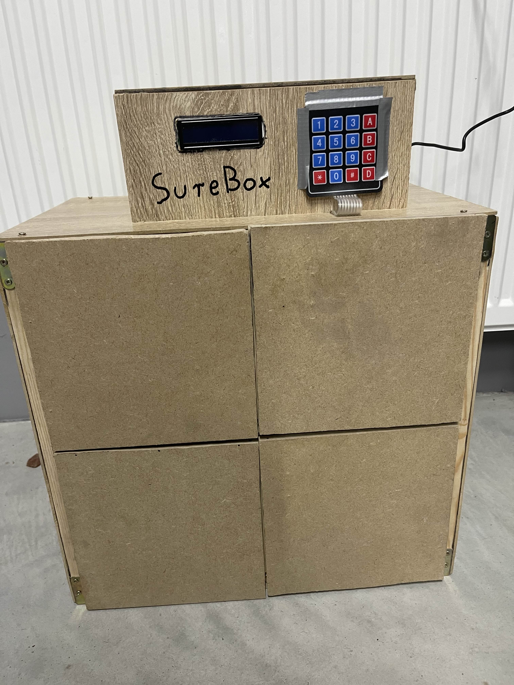
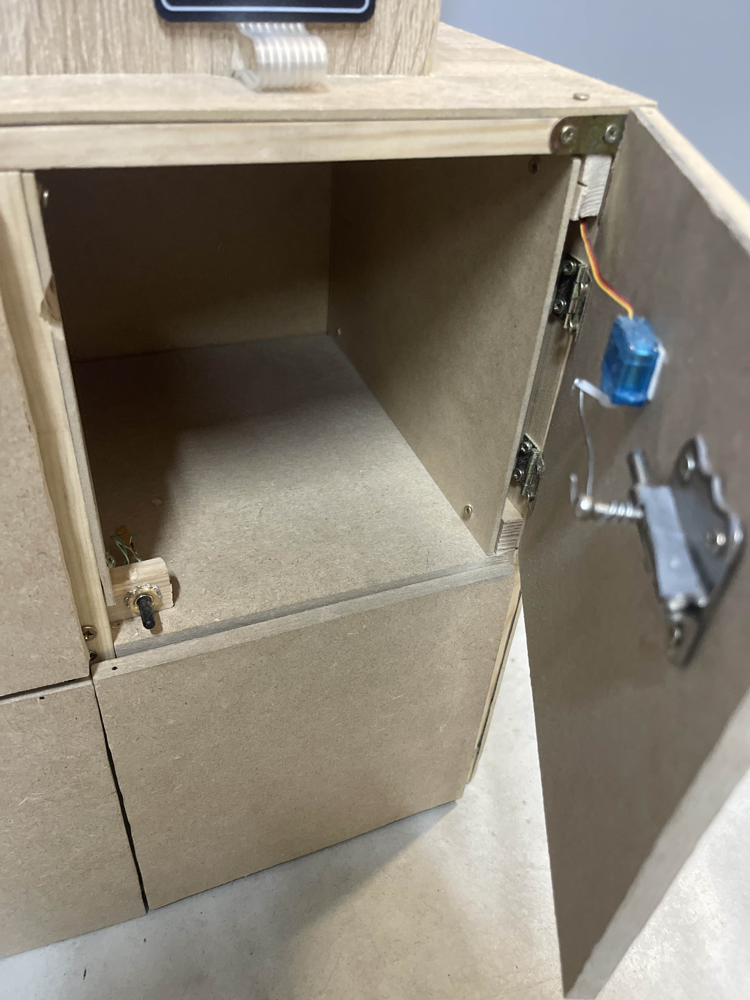
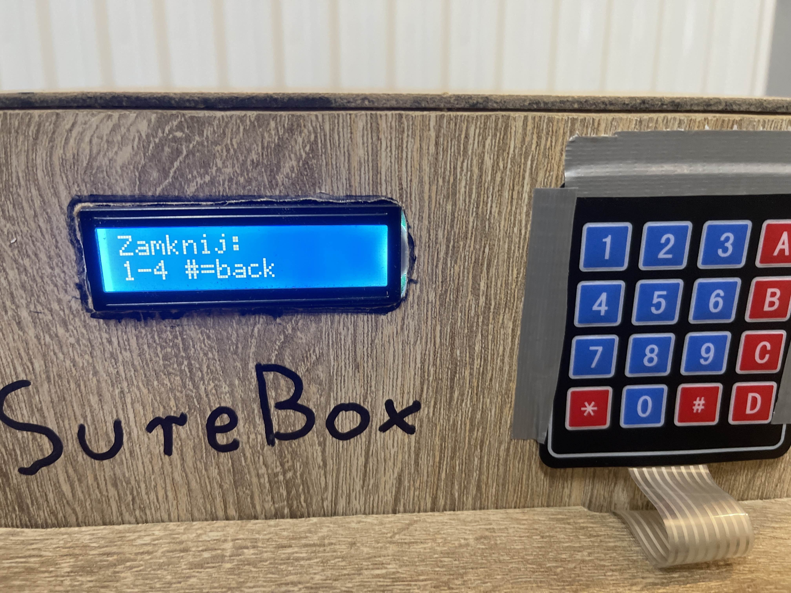

# Locker Management System
 
A smart locker management system built with Flask, SQLite, and Raspberry Pi. The system allows users to reserve, open, and return lockers using both a physical keypad interface and a mobile application.

## Features

- **User Management**: Registration, login, and authentication via tokens
- **Locker Management**: Reserve, open, close, and return lockers
- **Physical Interface**: LCD display and keypad for direct interaction
- **Mobile App**: Kivy-based client application for remote management
- **Hardware Control**: Servo motors for locking mechanism and sensors for locker state detection

## Locker Photos

Poniżej znajdują się zdjęcia przedstawiające skrytki użyte w systemie:

<p float="left">
  
  
  
</p>

## Database Structure (SQLite)

The system uses SQLite for data persistence. The database file is named `lockers.db` and contains two tables.

## Server Implementation (server.py)

The server is built with Flask and handles both the hardware control and API endpoints.

### Key Components

1. **Database Management**
   - `init_db()`: Initializes database tables and loads default data
   - `update_locker_in_db(locker_id)`: Updates locker state in the database

2. **Authentication**
   - `require_auth`: Decorator for API endpoints requiring authentication
   - `generate_token(username)`: Creates authentication tokens
   - `get_user_by_token(token)`: Retrieves user data by token

3. **Hardware Control**
   - `set_angle(angle, servo_pin)`: Controls servo motor position
   - `unlock_locker(locker_id)`: Unlocks a locker
   - `lock_locker(locker_id)`: Locks a locker
   - `sensor_thread()`: Background thread monitoring door sensors
   - `keypad_thread()`: Background thread handling keypad input

4. **Physical Interface**
   - LCD menu system with the following options:
     - Opening lockers with PIN code
     - Closing lockers
     - Locker selection
     - Code entry

## API Endpoints

| Endpoint | Method | Auth | Description |
|----------|--------|------|-------------|
| `/register` | POST | No | Register a new user |
| `/login` | POST | No | Authenticate and receive token |
| `/lockers` | GET | No | List all lockers and their status |
| `/lockers/<id>/unlock` | POST | Yes | Unlock a specific locker |
| `/lockers/<id>/lock` | POST | No | Lock a specific locker |
| `/lockers/<id>/return` | POST | Yes | Return a reserved locker |
| `/lockers/deposit` | POST | Yes | Reserve and open a locker |

## Setup and Installation

1. **Prerequisites**
   - Raspberry Pi with Python 3
   - Required hardware: I2C LCD display, 4x4 keypad, servo motors, door sensors
   - Python packages: flask, flask-cors, RPLCD, pigpio, RPi.GPIO

2. **Installation**
   ```bash
   pip install flask flask-cors RPLCD pigpio RPi.GPIO
   ```

3. **Database Setup**
   The database will be automatically created and initialized when running server.py for the first time.

4. **Starting the Server**
   ```bash
   python server.py
   ```

## SQLite Usage Examples

### Querying Users

```python
def get_user_by_username(username):
    conn = sqlite3.connect(DB_NAME)
    c = conn.cursor()
    c.execute("SELECT id, username, token FROM users WHERE username=?", (username,))
    row = c.fetchone()
    conn.close()
    return row
```

### Updating Locker Status

```python
def update_locker_status(locker_id, status):
    conn = sqlite3.connect(DB_NAME)
    c = conn.cursor()
    c.execute("UPDATE lockers SET status=? WHERE id=?", (status, locker_id))
    conn.commit()
    conn.close()
```


## Client Application

The system includes a Kivy-based mobile client (`app_client.py`) that allows users to:
- Login and register
- View all lockers and their status
- Reserve, open, close and return lockers

Run the client with:
```bash
python app_client.py
```
